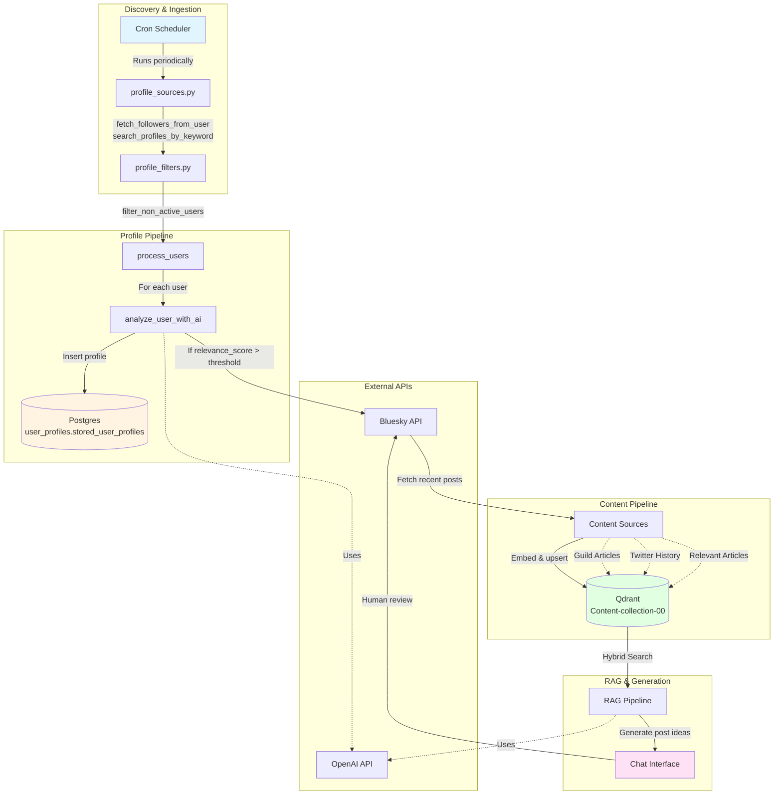

# The Guild Bluesky Agent System

## Overview

Automated system to grow Guild presence on Bluesky by discovering, analyzing, and following relevant accounts, while curating content for AI-powered post generation.

**Objectives:**
- Discover and follow 5–10 high-relevance accounts per day
- Analyze and persist profile data (Postgres + Qdrant)
- Curate content from profiles, articles, and social history
- Generate post ideas via RAG-powered chat interface

---

## Current Progress

### ✅ Implemented

**Profile Discovery & Analysis Pipeline** (`07-analyze-and-record-bluesky-profiles.ipynb`):
- `fetch_followers_from_user()` – Fetch followers from target accounts with activity filtering
- `search_profiles_by_keyword()` – Discover profiles via keyword search
- `filter_non_active_users()` – Filter to users active in last 30 days
- `analyze_user_with_ai()` – AI-powered relevance scoring using Instructor + OpenAI
- `process_users()` – Batch processing: analyze → follow → persist to Postgres
- `insert_user_profile()` – Upsert to `user_profiles.stored_user_profiles` (Postgres)
- `is_user_in_db()` – Check follow status in database

**Content Collection** (`05-qdrant-content-collection.ipynb`, `06-rag-content.ipynb`):
- Qdrant `Content-collection-00` with hybrid search (dense + BM25)
- Ingestion of Guild Medium articles and Twitter history
- RAG pipeline for content retrieval and post generation

**Utilities** (`notebooks/personal-project/utils/`):
- `profile_sources.py` – Profile fetching and discovery
- `profile_filters.py` – Activity filtering
- `schemas.py` – Pydantic models (UserProfile, RankedUser, StoredUserProfile)
- `follow_profiles.py` – Follow/unfollow actions

---

## Architecture

### System Components

### Data Flow

**Profile Pipeline (SQL-based):**
1. **Cron** triggers profile discovery functions from `profile_sources.py`
2. **Discovery**: `fetch_followers_from_user()` or `search_profiles_by_keyword()` returns candidate profiles
3. **Filtering**: `filter_non_active_users()` filters to active users (last 30 days)
4. **Processing**: `process_users()` processes each profile:
   - Checks if already in Postgres via `is_user_in_db()`
   - If new: calls `analyze_user_with_ai()` for relevance scoring
   - Inserts/updates Postgres with `insert_user_profile()`
   - Optionally follows user via `follow_user()`

**Content Pipeline (Vector-based):**
1. **Profile Analysis**: When `analyze_user_with_ai()` determines `relevance_score > threshold`:
   - Fetches recent posts from the profile
   - Embeds and upserts posts to Qdrant `Content-collection-00`
2. **Content Sources**: Qdrant is fed from:
   - **Analyzed profiles**: Posts from high-relevance accounts
   - **Guild articles**: Medium articles and blog posts
   - **Twitter history**: Historical tweets
   - **External articles**: Relevant articles from other sources
3. **RAG Generation**: Chat interface queries Qdrant via hybrid search:
   - Retrieves relevant content chunks
   - Generates post ideas grounded in retrieved content
   - Human reviews and approves before posting

---

## Data Stores

### Postgres (`user_profiles.stored_user_profiles`)
- **Purpose**: Source of truth for analyzed profiles and follow status
- **Schema**: `handle`, `display_name`, `description`, `did`, `relevance_score`, `reasoning`, `follow_status`, `last_updated`
- **Operations**: Upsert via `insert_user_profile()`, query via `is_user_in_db()`

### Qdrant (`Content-collection-00`)
- **Purpose**: Vector store for content retrieval and RAG
- **Features**: Hybrid search (dense embeddings + BM25)
- **Content Types**: Posts from analyzed profiles, Guild articles, Twitter history, external articles
- **Metadata**: `poster_handle`, `date`, `media_urls`, `text`, `author`, `mediaType`, `source_type`

---

## Tech Stack

- **Language**: Python
- **AI/ML**: OpenAI (GPT-4, text-embedding-3-small), Instructor for structured outputs
- **Vector DB**: Qdrant (hybrid dense + BM25 search)
- **SQL DB**: Postgres (`user_profiles` schema)
- **APIs**: Bluesky (ATProto client)
- **Scheduling**: Cron (local/prototype), Airflow (production)
- **Orchestration**: LangGraph (future agent workflows)

---

## Key Functions

### Profile Discovery (`utils/profile_sources.py`)
- `fetch_followers_from_user(client, username, max_followers, filter_active=True)` – Fetch and filter followers
- `search_profiles_by_keyword(client, keyword, limit=100)` – Discover profiles via search
- `get_my_profile(client)` – Get authenticated user's profile

### Profile Processing (`07-analyze-and-record-bluesky-profiles.ipynb`)
- `analyze_user_with_ai(user, my_profile, openai_client)` – AI relevance analysis
- `process_users(users)` – Batch process: analyze → follow → persist
- `insert_user_profile(user_profiles)` – Upsert to Postgres
- `is_user_in_db(handle)` – Check follow status

### Content & RAG (`05-qdrant-content-collection.ipynb`, `06-rag-content.ipynb`)
- Content ingestion utilities for articles and tweets
- RAG pipeline for retrieval and generation
- Chat interface for post idea generation
