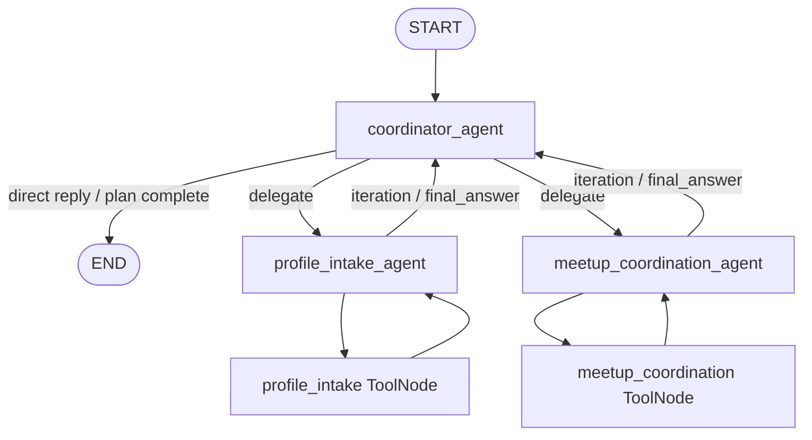

# ETHGlobal Cannes — Meetup Organizer Agent

**Vision:** Build an AI agent that organizes real-world meetups at ETHGlobal Cannes.

What if AI did not isolate people, but actually coordinated real human interaction?

Most people come to ETHGlobal to learn and meet people, not only to win prizes.

## Problem

- Everyone wants to connect.
- Nobody coordinates efficiently.

## Idea: Meetup Organizer Agent

An AI agent that:

- Chats with you (initially via **Telegram**; Discord is in scope for the product story).
- Understands what you want to learn and what you could teach.
- Matches you with relevant people.
- Organizes real meetups during the hackathon.

**Think:** AI + messaging + real-world coordination — turning the hackathon into a self-organizing learning network.

## Execution plan

| Phase | Goal |
|-------|------|
| **Friday** | Ship MVP: chat agent, matching, meetup proposals |
| **Saturday** | Onboard as many hackers as possible IRL |
| **Later** | Layer in **World** (human verification) and **0G Labs** (agent infra) |

## Implementation (short term)

This repo starts from the **Amazon shopping assistant** template used in the AI engineering bootcamp. We adapt it as follows:

1. **Replace the front-end UI** with a **Telegram bot** as the primary interface.
2. **Replace the agentic logic** with a chat agent that:
   - Accepts user requests in natural language, e.g. *“I want to learn X and I could teach Y”*.
   - **Appends** each request to a **global context** shared by the agent (later this becomes a Qdrant-backed store for clustering and retrieval).
   - Stays **polite** and does **not** reveal other users’ data to any single user.
   - Uses the updated context to **propose learning sessions** (e.g. a meetup where one person teaches and a group learns a subject).
   - **Notifies all relevant participants** when a new meetup is proposed.

**User identity in context:** Telegram handles are stored **next to** each user’s learn/teach request in the global context so the agent can reach out to the right people when coordinating meetups.

### Agent graph (FastAPI / LangGraph)

The backend graph is **coordinator-led**: one turn can chain specialists before the user gets a final answer.

| Node | Role |
|------|------|
| **coordinator_agent** | Routes the message: answer small-talk directly, or delegate to profile intake and/or meetup coordination (multi-step plans). |
| **profile_intake_agent** | Parses learn/teach intent and calls **`append_my_learning_profile`** to upsert the user in the **in-memory global registry** (MVP; replace with Qdrant later). |
| **meetup_coordination_agent** | Calls **`get_meetup_community_registry`** to read the full registry for planning only, then **`create_meetup_proposal_and_notify`** to record a session proposal and enqueue **per-participant notifications** (handles included for the Telegram layer). Prompts require **privacy-safe** replies: no other users’ handles or profiles in the user-visible text. |

Tool nodes mirror the shopping template: each specialist can loop on tools until `final_answer` is set, then control returns to the coordinator.

Legacy **Amazon shopping** agent functions remain in `agents.py` for reference; the live graph no longer uses Qdrant for the final response (that block is **commented** in `graph.py`).

**API:** `POST /rag` accepts optional **`telegram_handle`** on the request body; if omitted, the backend uses `thread_id` as the display handle.

---

*ETHGlobal Cannes — AI that connects people in the real world.*
